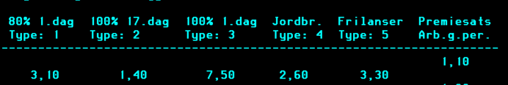

# sp-forsikring

Denne applikasjonen svarer Spleis på hva slags forsikring en bruker har, til bruk for å regne ut
tilleggssykepenger (Folketrygdloven § 8-36 og § 8-39).

## Struktur i `sp-forsikring`

Koden i `sp-forsikring` er organisert etter løk-arkitektur (onion architecture), feature-først:

- `shared`: felleskode som logging, utils og test-støtte.
- `forsikringsvurdering`: hovedflyt for vurdering av forsikring.
- `oppslag`: oppslag mot Infotrygd/replikabase og lagring av oppslag.
- `oppgaver`: oppretting av oppgaver og tilhørende rivers.

Hver feature følger dette mønsteret:

- `domain/`: rene domenetyper og -logikk.
- Rot-nivå i feature-pakken: service og port-grensesnitt (abstraksjoner).
- `infrastructure/`: konkrete implementasjoner (database, rapids, HTTP-klienter o.l.).

## Kjøpte Nav-forsikringstyper i Infotrygd
Det er fem forskjellige typer forsikringer dennne appen finner svar om fra Infotrygd. De er ligger som type 1 til 5 i dataen fra Infotrygd.
Hva de tallene betyr vises i dette skjermbildet:

- Type 1: 80 % dekningsgrad fra dag 1.
- Type 2: 100 % dekningsgrad fra dag 17.
- Type 3: 100 % dekningsgrad fra dag 1.
- Type 4: 100 % dekningsgrad fra dag 1, spesifikt for jordbrukere. Disse har allerede kollektiv forsikring som gir de 100 % dekningsgrad fra dag 17, så dette er en ekstra forsikring som gir de 100 % dekningsgrad fra dag 1.
- Type 5: 100 % dekningsgrad fra dag 1, spesifikt for frilansere.

Tallene under hver type viser prosent av premiegrunnlaget forsikringen koster i 2025. Disse oppdateres hvert år, så de endres.

## Henvendelser

Spørsmål knyttet til koden eller prosjektet kan stilles som issues her på GitHub.

### For NAV-ansatte

Interne henvendelser kan sendes via Slack i
kanalen [#sykepenger-værsågod](https://nav-it.slack.com/archives/C019637N90X).

## Kode generert av GitHub Copilot

Dette repoet bruker GitHub Copilot til å generere kode.
